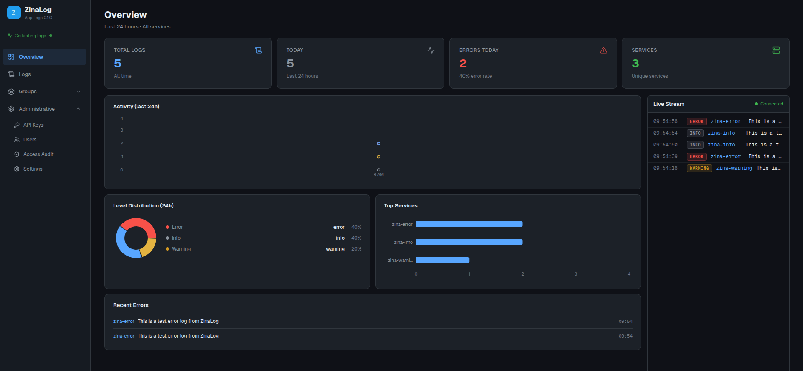

# ZinaLog

ZinaLog is a lightweight, self-hosted logging server with a web dashboard for collecting, searching, and monitoring application logs — without needing a full observability stack.

## Quick Start

```bash
npx create-zinalog my-app
cd my-app
npm run dev
```

Open:

```
http://localhost:3000
```




## Why ZinaLog

* Runs anywhere with **zero infrastructure overhead**
* Designed for teams that don’t want ELK/Grafana complexity
* Fast setup — operational in minutes
* Cost-efficient for small to mid-scale systems
* Built for real-world debugging, not dashboards for show

## Features

* HTTP log ingestion (`POST /api/logs`)
* Real-time log streaming
* Dashboard for logs, errors, and metrics
* Role-based access (`admin`, `operator`, `viewer`)
* API key authentication with IP restrictions
* Rate limiting
* Alerts (email, Slack, Telegram, Discord)
* Alert thresholds and cooldowns
* Optional access auditing
* SQLite-based storage (lightweight deployment)


## Documentation

Full documentation available here:  https://zinalog.com

## Status

ZinaLog is in early development. Expect changes and improvements.

## 🛠 Requirements

- Node.js 20+
- npm
